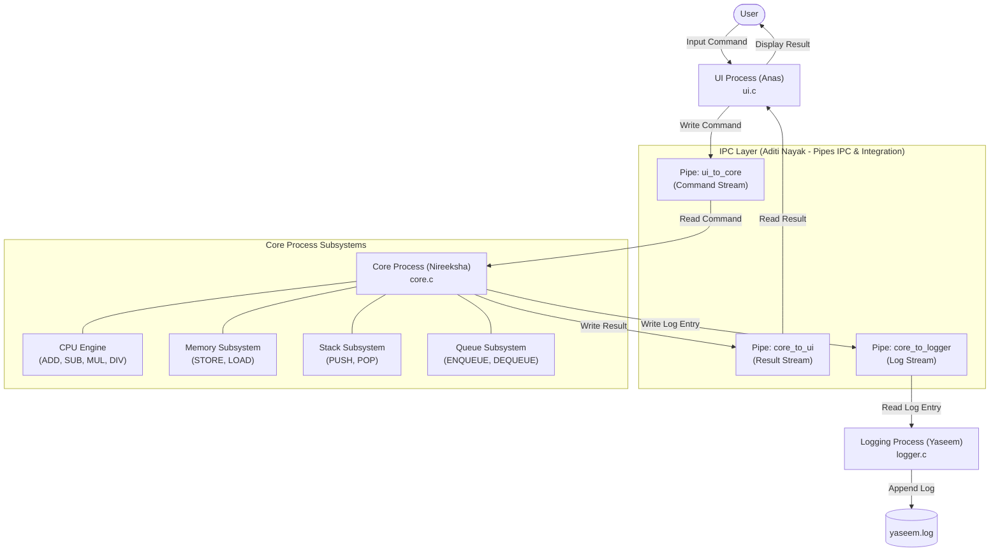

# Multi-Process Simulator (Week 4 PBL)

A multi-process system simulator implemented in C for Operating Systems PBL. The simulator models a modular computer architecture separated into three independent concurrent processes communicating via **POSIX Pipes Inter-Process Communication (IPC)**.

---

## Team Members & Responsibilities

| Team Member | Role | Technical Responsibility |
|:---|:---|:---|
| **Aditi Nayak** *(Team Leader)* | **IPC Architect & Integration** | **POSIX Pipes IPC**, process lifecycle management (`pipe()`, `fork()`, `waitpid()`, `close()`), descriptor hygiene, end-to-end integration, and system verification |
| **Nireeksha** | UI Process | User interaction, command validation, interactive REPL interface, and result rendering |
| **Anas Ahmed** | Core Process | Computational core containing CPU arithmetic, Memory, Stack, and Queue subsystems |
| **Yaseem** | Logging Process | System logging daemon, log formatting, and persistent disk recording (`yaseem.log`) |

---

## System Architecture

The overall system pipeline flows as follows:

$$\text{User} \longrightarrow \text{UI Process} \overset{\text{Pipe}}{\rightleftharpoons} \text{Core Process (CPU / Memory / Stack / Queue)} \overset{\text{Pipe}}{\longrightarrow} \text{Logging Process} \longrightarrow \text{Disk Log}$$

### Architecture Diagram



---

## IPC Mechanism – Pipes

### 1. What Pipes Are
A POSIX Pipe is a unidirectional Inter-Process Communication (IPC) channel managed directly inside the operating system kernel. A pipe provides two file descriptors:
- A **Read descriptor** (`fd[0]`)
- A **Write descriptor** (`fd[1]`)

Data written to the write end is buffered in memory by the OS kernel and read in First-In-First-Out (FIFO) byte-stream order from the read end.

### 2. Why Our Team Selected Pipes
1. **Unidirectional Pipeline Topology**: The simulator follows a natural pipeline (`UI -> Core -> Logger`). Pipes represent the cleanest abstraction for one-way and paired request-response streaming.
2. **Kernel-Managed Synchronization**: When a reader attempts to read from an empty pipe, the OS blocks the reading process until data arrives or all write descriptors are closed (EOF). This eliminates the need for manual spinlocks, mutexes, or busy waiting.
3. **Low Overhead & Memory Safety**: Pipes do not write intermediate data to disk and do not require complex shared-memory race condition handling or shared address mapping.
4. **Clean Process Decoupling**: Anas's UI, Nireeksha's Core, and Yaseem's Logger run in isolated address spaces. A fault or crash in one subsystem does not corrupt memory in the others.

### 3. Which Processes Communicate
Three independent processes communicate through three dedicated pipes:
1. **`ui_to_core` Pipe**: Connects UI Process (write end) to Core Process (read end). Delivers validated commands (`ADD 10 20\n`, `STORE 5 99\n`, etc.).
2. **`core_to_ui` Pipe**: Connects Core Process (write end) to UI Process (read end). Delivers execution outcomes (`CPU: 10 + 20 = 30\n`, `Memory: Stored 99 at address 5\n`, etc.).
3. **`core_to_logger` Pipe**: Connects Core Process (write end) to Logging Process (read end). Delivers timestamped/PID audit records and the termination notice (`LOGGER_EXIT`).

### 4. How Information Flows
1. **User Input**: The user enters a command at the UI prompt (e.g. `ADD 10 20`).
2. **UI -> Core**: The UI Process cleans the input and writes `ADD 10 20\n` into the write end of `ui_to_core`.
3. **Core Execution**: The Core Process reads the command from `ui_to_core`, parses it, and executes the appropriate subsystem (CPU, Memory, Stack, or Queue).
4. **Core -> UI**: The Core Process writes the formatted result string into `core_to_ui`. The UI reads and displays it on the user's terminal.
5. **Core -> Logger**: Concurrently, the Core formats an audit entry `[CORE PID: <pid>] Command: ADD 10 20 | Result: CPU: 10 + 20 = 30\n` and writes it into `core_to_logger`.
6. **Logging & Persistence**: The Logging Process reads the entry from `core_to_logger`, echoes `[LOGGER] Received: ...`, and appends the record into `yaseem.log`.
7. **Clean Termination**: When `EXIT` is entered, UI sends `EXIT\n`, Core notifies UI, writes `LOGGER_EXIT\n` to Logger, and all processes terminate gracefully.

### 5. POSIX Functions Used
- **`pipe(int pipefd[2])`**: Creates the three anonymous pipe channels before any child processes are created.
- **`fork()`**: Spawns the three child processes from the coordinator process, creating genuine OS processes with their own memory spaces and PIDs.
- **`read()` / `fgets()`**: Receives data from the read descriptor. Blocks until bytes are available or returns EOF (0) when all writers close their descriptors.
- **`write()` / `fprintf()`**: Transmits commands, replies, and log strings across the write descriptors with immediate `fflush()` flushing.
- **`close()`**: Used to close unused descriptor ends immediately after `fork()`. Also used by parent coordinator to release its pipe references, allowing EOF signaling when a process terminates.
- **`waitpid()` / `wait()`**: The parent coordinator waits for the termination of the UI, Core, and Logging processes, preventing zombie processes and ensuring clean cleanup.

### 6. Why Pipes Are Suitable for This Simulator
Pipes provide the exact balance of simplicity, speed, and safety needed for an Operating Systems multi-process project:
- No shared memory corruption risks.
- Automatic kernel buffering and flow control.
- Natural EOF signaling when write ends are closed.
- Complete modularity between team member implementations.

---

## Supported Commands

| Subsystem | Command Syntax | Description | Example |
|:---|:---|:---|:---|
| **CPU** | `ADD <a> <b>` | Adds two integers | `ADD 10 20` $\rightarrow$ `CPU: 10 + 20 = 30` |
| **CPU** | `SUB <a> <b>` | Subtracts two integers | `SUB 50 15` $\rightarrow$ `CPU: 50 - 15 = 35` |
| **CPU** | `MUL <a> <b>` | Multiplies two integers | `MUL 6 7` $\rightarrow$ `CPU: 6 * 7 = 42` |
| **CPU** | `DIV <a> <b>` | Divides two integers (handles divide by zero) | `DIV 20 4` $\rightarrow$ `CPU: 20 / 4 = 5` |
| **Memory** | `STORE <addr> <val>` | Stores an integer at a memory address (0-99) | `STORE 5 100` |
| **Memory** | `LOAD <addr>` | Retrieves an integer from memory | `LOAD 5` $\rightarrow$ `Memory[5] = 100` |
| **Stack** | `PUSH <val>` | Pushes value onto LIFO stack | `PUSH 42` |
| **Stack** | `POP` | Pops value from LIFO stack | `POP` $\rightarrow$ `Stack: Popped 42` |
| **Queue** | `ENQUEUE <val>` / `ENQ <val>` | Enqueues value into FIFO queue | `ENQUEUE 99` |
| **Queue** | `DEQUEUE` / `DEQ` | Dequeues value from FIFO queue | `DEQUEUE` $\rightarrow$ `Queue: Dequeued 99` |
| **UI** | `HELP` | Displays the help menu | `HELP` |
| **System** | `EXIT` | Terminates UI, Core, and Logger processes | `EXIT` |

---

## Building and Running

### Linux / macOS / WSL
```bash
# Navigate to Week 2 folder
cd "Week 2"

# Build using Makefile
make

# Or compile directly with GCC
gcc -Wall -Wextra -O2 -o simulator main.c ui.c core.c logger.c -pthread

# Run the simulator
./simulator
```

### Windows (MinGW GCC)
```powershell
# Navigate to Week 2 folder
cd "Week 2"

# Compile with MinGW GCC
gcc -static -Wall -Wextra -O2 main.c ui.c core.c logger.c -o simulator.exe

# Run the simulator
.\simulator.exe
```

---

## Verification & Test Results

The implementation was tested against all required test scenarios:

### Test 1 — Normal Command Execution
- **Input**: `ADD 10 20`
- **Verification**:
  - UI wrote `ADD 10 20\n` to `ui_to_core` pipe.
  - Core read the command, invoked CPU `executeCommand`, computed $10 + 20 = 30$.
  - Core sent `CPU: 10 + 20 = 30` to `core_to_ui` pipe.
  - UI displayed `Result: CPU: 10 + 20 = 30`.
- **Status**: **PASSED**

### Test 2 — Logging to File
- **Input**: `STORE 5 100`, followed by `LOAD 5`
- **Verification**:
  - Core executed the memory operations (`Memory[5] = 100`).
  - Core sent log string `[CORE PID: 25712] Command: STORE 5 100 | Result: Memory: Stored 100 at address 5\n` across `core_to_logger` pipe.
  - Logger received message from pipe, displayed `[LOGGER] Received: ...`, and appended to `yaseem.log`.
- **Status**: **PASSED**

### Test 3 — Error Handling & Logging
- **Input**: `DIV 10 0` and `INVALID_CMD`
- **Verification**:
  - `DIV 10 0`: Core detected $b = 0$, returned `CPU: Division by zero`.
  - `INVALID_CMD`: Core returned `Core: Invalid command`.
  - Both errors were communicated back to UI and recorded into `yaseem.log`.
- **Status**: **PASSED**

### Test 4 — Multiple Commands Sequence
- **Input**: Multiple operations spanning CPU, Memory, Stack (`PUSH 42`, `POP`), Queue (`ENQUEUE 99`, `DEQUEUE`), and `EXIT`.
- **Verification**:
  - Pipeline maintained consistent ordering across all pipes.
  - `EXIT` propagated cleanly: Core notified Logger with `LOGGER_EXIT`, Logger closed its log file, and all processes exited cleanly with exit status 0.
- **Status**: **PASSED**

---

## Repository Structure

```
zotify/
├── README.md                      # Documentation & Architecture
├── .gitignore                     # Build and runtime artifact ignore list
├── PBL                            # Course project metadata
├── aditi_zotify.docx              # Week 1 documentation
├── INTERPROCESS COMMUNICATION.docx# Week 1 documentation
├── IPCSharedMemory_PBL.docx       # Week 1 documentation
├── IPC_PBL WEEK 1.docx            # Week 1 documentation
└── Week 2/                        # Multi-Process Simulator Implementation
    ├── main.c                     # IPC Coordinator & Entry Point (Aditi Nayak)
    ├── pipe_ipc.h                 # IPC Header & Cross-Platform POSIX Definitions
    ├── ui.h / ui.c                # UI Process (Anas Ahmed)
    ├── core.h / core.c            # Core Process (Nireeksha)
    ├── logger.h / logger.c        # Logging Process (Yaseem)
    ├── Makefile                   # Build configuration
    ├── Core Process               # Teammate's original Core Process (synchronized)
    ├── Logging Process            # Teammate's original Logging Process (synchronized)
    └── ui nii.c                   # Teammate's original UI Process (synchronized)
```
